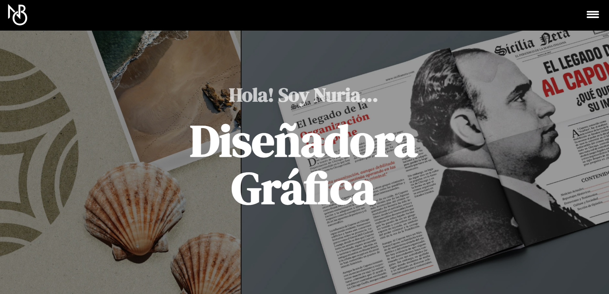
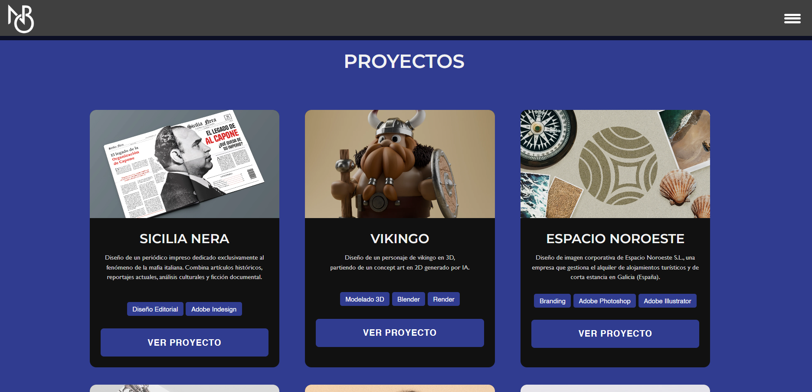
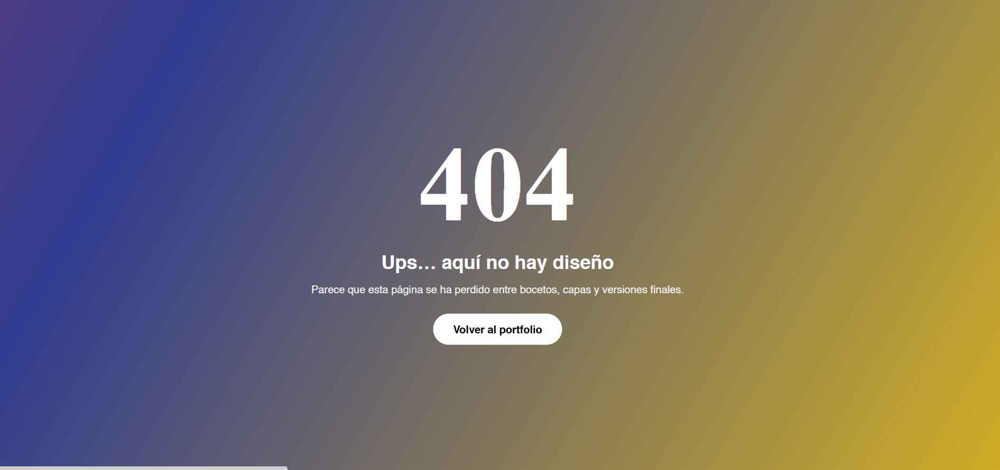

# Bienvenido a mi portfolio de diseño gráfico!

>Aquí puedes encontrar mi sitio en vivo! [https://nuriabeoldan-dev.github.io/design-portfolio-template/](https://nuriabeoldan-dev.github.io/design-portfolio-template/)


## Descripción

Este proyecto consiste en una plantilla de portfolio web para diseñadores/as gráficos/as.
Ha sido desarrollada como proyecto final del curso con el objetivo de crear una base reutilizable,
flexible y escalable, pensada para evolucionar con el tiempo y adaptarse a distintos estilos visuales.

No es un portfolio puntual, sino una estructura que puede reutilizarse y personalizarse fácilmente
para futuros proyectos.


## Stack tecnológico

Este proyecto se ha desarrollado utilizando tecnologías web fundamentales:

- **HTML5** semántico
- **CSS3** organizado por arquitectura modular  
  - base  
  - layout  
  - components  
  - index  
  - otros
- **JavaScript vanilla** para interacciones básicas
- **Git & GitHub** para control de versiones
- **GitHub Pages** para el despliegue

> No se han utilizado frameworks complejos para priorizar el entendimiento de los fundamentos.


## Configuración para desarrollo local

1. Clona el repositorio:
   ```bash
   git clone https://github.com/nuriabeoldan-dev/design-portfolio-template.git


## Guía de personalización

### Personalización de contenidos
- Los textos principales pueden modificarse directamente en el archivo `index.html`.
- Cada sección del portfolio (hero, sobre mí, proyectos, contacto) está claramente separada mediante secciones `<section>`.


### Imágenes

- Las imágenes del hero, proyectos y secciones se encuentran en la carpeta `assets/img/`.
- Para sustituirlas, basta con reemplazar los archivos manteniendo el mismo nombre
  o actualizar la ruta en el HTML.


### Colores y estilos

- Los colores principales del sitio están definidos en los archivos CSS dentro de `assets/css/`.
- Cambiando los valores de color (por ejemplo, el azul principal `#303c90`) se puede adaptar fácilmente la identidad visual del portfolio.

### Tipografía

- Las tipografías se cargan desde Google Fonts en el `<head>` del HTML.
- Para cambiar la fuente, basta con modificar el enlace de Google Fonts
  y actualizar las reglas CSS de `font-family`.

### Proyectos

- Cada proyecto está organizado en forma de tarjeta dentro de la sección "Proyectos".
- Para añadir un nuevo proyecto, se puede duplicar una card existente y modificar su imagen, texto y etiquetas.

## Demo visual





## Créditos y agradecimientos

Agradecimientos al profesor Rubén Vega Balbás, y a la filosofía del atelier: aprender haciendo, equivocarse rápido y mejorar poco a poco.

Esta plantilla no pretende ser perfecta, sino útil, adaptable y en evolución constante.

## Autora

Nuria Beiro Oldán  
Diseño Gráfico & Web

# Política de Uso de Agentes de IA
Durante el desarrollo de este proyecto se ha utilizado un único asistente de IA (ChatGPT) como herramienta de apoyo puntual. Toda la interacción con IA ha tenido lugar exclusivamente en una única conversación, utilizada como refuerzo conceptual, organizativo y técnico.

## Fase 1: Planificación
Antes de implementar nuevas secciones o funcionalidades, se ha utilizado la IA para:

- Aclarar requisitos del proyecto.
- Desglosar problemas técnicos en pasos asumibles.
- Proponer estructuras de HTML, CSS y JavaScript acordes a buenas prácticas.
- Evaluar distintas opciones de diseño y arquitectura.

Estas consultas se han enfocado siempre a entender el problema y planificar la solución, no a copiar código sin criterio.

## Fase 2: Implementación
Una vez comprendida y validada la planificación:

- El código se ha escrito, adaptado y ajustado manualmente.
- Las soluciones propuestas por la IA han sido modificadas para encajar con la estética, estructura y decisiones del proyecto.
- Se ha priorizado el aprendizaje y la experimentación sobre la automatización.

## Documentación de Uso de IA
Dado que el uso de IA ha sido continuo y transversal dentro de una misma conversación, y no dividido en tareas aisladas, no se han generado archivos docs/planX.md independientes por feature.

En su lugar:

- Esta sección del README actúa como documentación centralizada del uso de IA.
- Todas las decisiones relevantes han sido entendidas, razonadas e implementadas conscientemente.
- El proyecto refleja un proceso de aprendizaje activo (“aprender haciendo”), no una delegación del trabajo creativo o técnico.

Este proyecto es el resultado de combinar práctica, experimentación y acompañamiento técnico, manteniendo siempre la responsabilidad autoral y el control creativo del trabajo.